# Preparando seu ambiente para o início das aulas!

Para facilitar a sua vida durante o semestre, recomendamos que utilize uma estrutura de arquivos e diretórios padronizada, vai ajudar na hora de encontrar documentos para consultas rápidas ou mesmo para trabalhar nos projetos. 

## Organizando seus arquivos

Crie uma estrutura de pastas parecida com esta no seu sistema, procure manter seus arquivos fáceis de encontrar, você do futuro vai agradecer bastante se os arquivos estiverem organizados de uma forma intuitiva, acredite, a memória pode falhar nas horas de maior necessidade.

**Documentos > Insper > 2023 > 1-Semestre > Materias…**

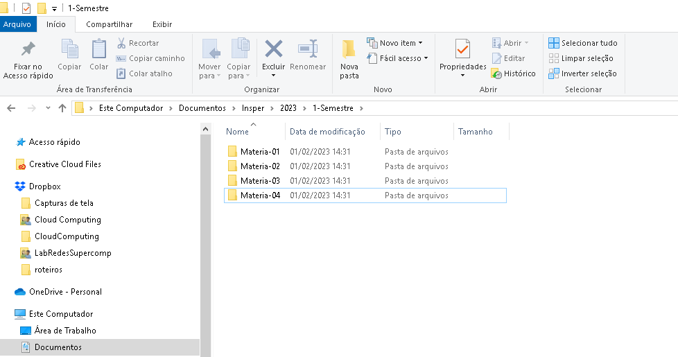

Uma boa prática na hora de nomear os seus arquivos e pastas é evitar acentos e espaços, pois, quando estiver usando alguma linguagem de programação, pode acontecer confusões no interpretador da linguagem por causa de algum acento ou de um espaço no caminho do arquivo. Vamos evitar pra prevenir chateações.

## Instalando o Visual Studio Code

Falando em programação, todos vocês vão precisar de um editor de código para trabalhar em projetos que envolvem programação, claro que cada matéria tem as suas recomendações, porém, escolhemos o Visual Studio Code como exemplo para ambientar vocês.

[Na página do Visual Studio Code](https://visualstudio.microsoft.com/), escolha a sua plataforma e faça o download do instalador.

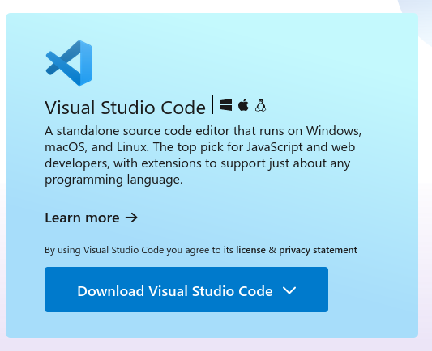

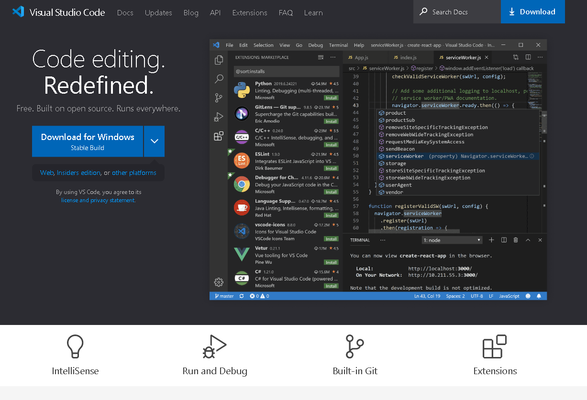

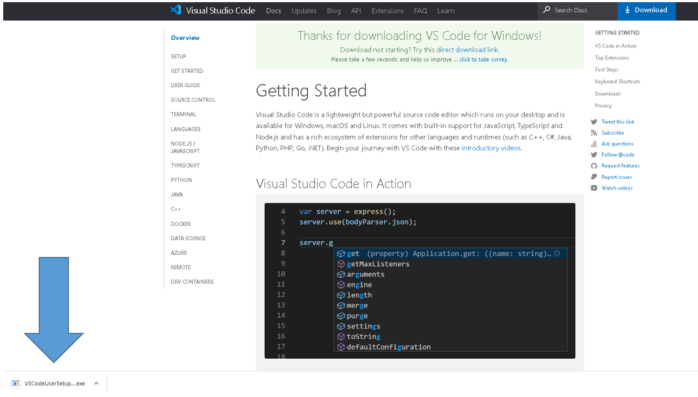

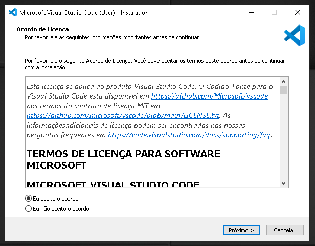

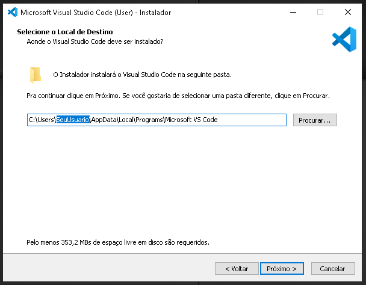

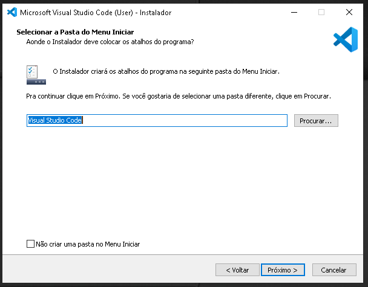

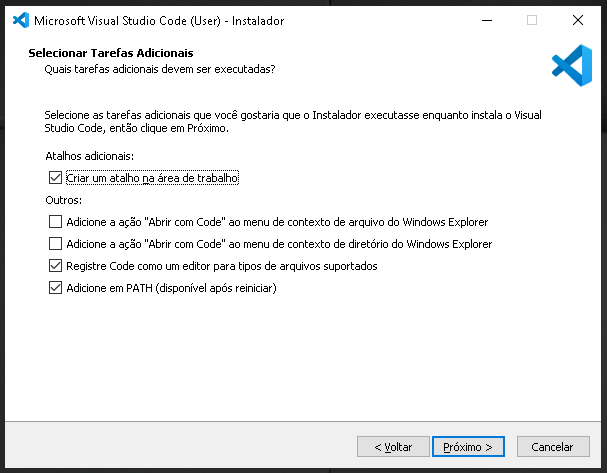

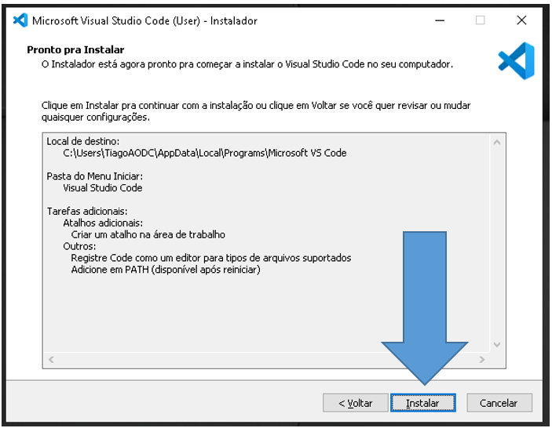

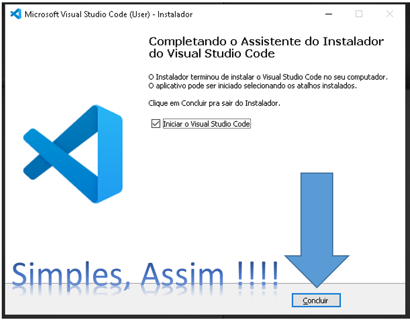

## Instalando o Anaconda

Anaconda é um framework com suporte as linguagens de programação Python e R com foco em ciência de dados, o objetivo é facilitar a vida de quem vai trabalhar com ciência de dados, pois o anaconda facilita o gerenciamento dos pacotes e das bibliotecas necessárias.

Faça o download do [anaconda no site oficial](https://www.anaconda.com/).

`Não inicie a instalação como administrador, a menos que o software exija privilégios de administrador.`

Leia e aceite os termos e condições, É recomendado que você instale no modo **Just Me**, que instalará o Anaconda Distribution apenas para a conta de usuário atual, clique em next.

No pŕoximo passo, selecione uma pasta para instalar o Anaconda e clique em Avançar. **Instale o Anaconda em um caminho de diretório que não contenha espaços ou caracteres unicode**.

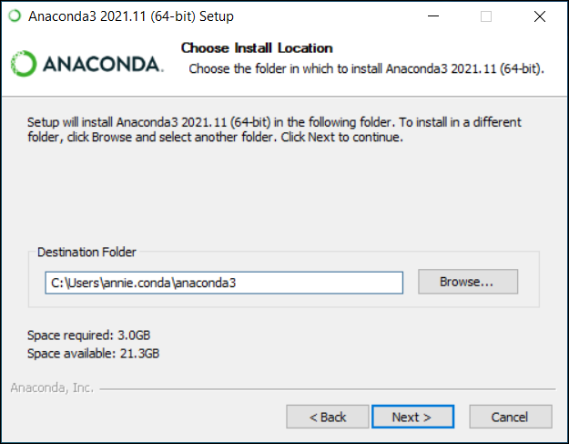

Adicione o Anaconda como seu Python padrão.

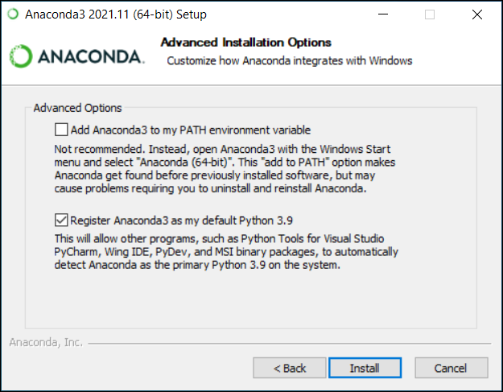

Clique em Install, depois em Next, até que complete a instalação.

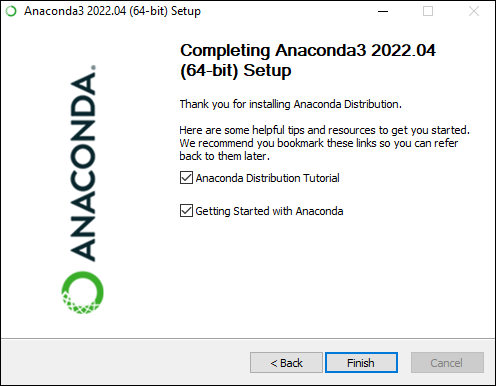

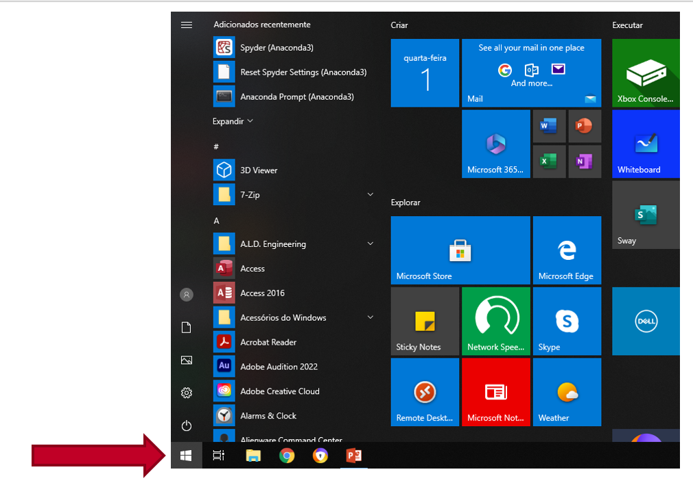

Clicar no Ícone MENU INICIAR e digitar Anaconda…

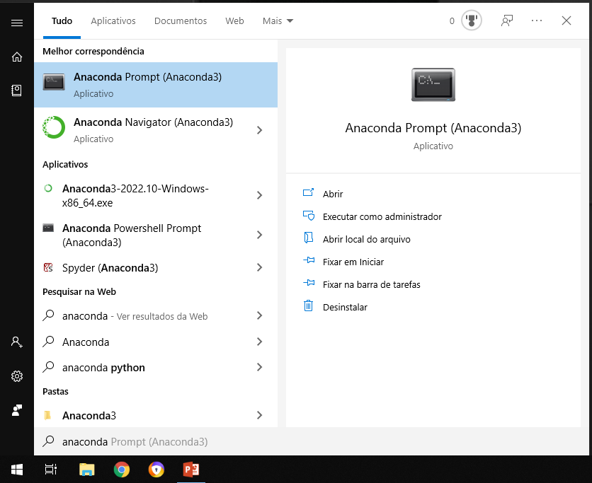

Para consultas segue site da documentação oficial abaixo:

Fonte: [Documentação oficial do Anaconda](https://docs.anaconda.com/anaconda/install/windows/)

## Ferramentas úteis disponíveis:

Com o seu email Insper, você tem acesso ao One Drive com 5 Teras de espaço e ao Pacote Office completo, tanto na versão online como na versão local, vamos mostrar pra você, como aproveitar essas ferramentas para facilitar a sua vida durante a graduação.

## One Drive

O OneDrive permite aos usuários exibir arquivos em um navegador, compartilhar e acessar conteúdos em qualquer dispositivo através do aplicativo.

As vantagens do OneDrive:

- Aplicativo de sincronização para Windows e Mac
- Aplicativos móveis para Android e iOS
- Experiência  Web
- Integração com aplicativos do Microsoft 365 e uma experiência comum de compartilhamento de arquivos

## **Usando o OneDrive via navegador**

Entre no site [https://www.office.com/](https://www.office.com/), faça login clicando no bonequino localizado no canto superior direito da página

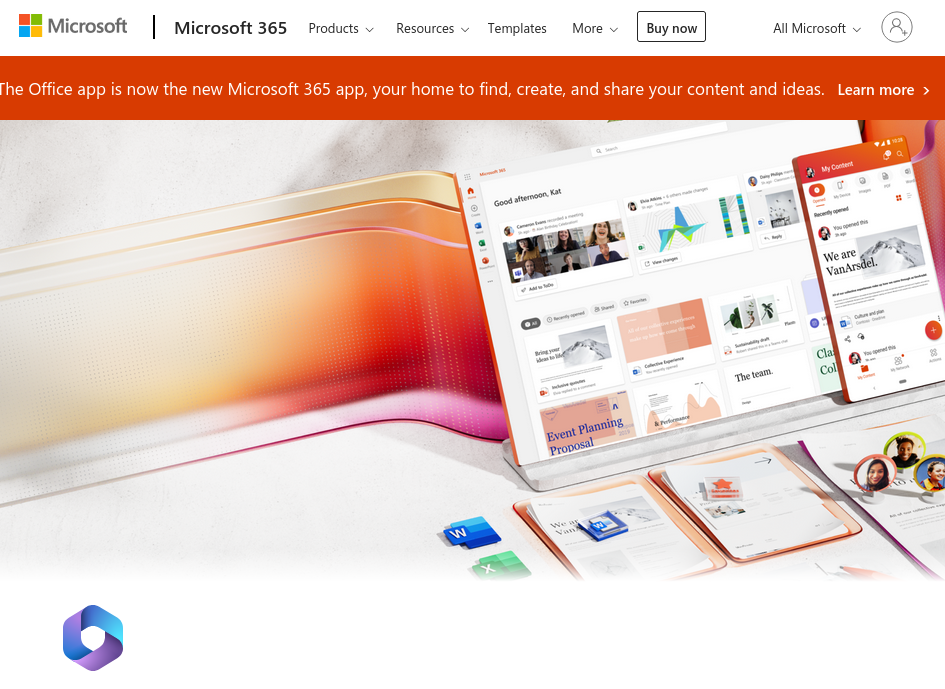

No menu de aplicativos localizado na barra de ferramentas a esquerda, encontre a opção OneDrive

Uma nova página será aberta para você, nessa interface você poderá criar novos arquivos Word, Excel, PowePoint, editar arquivos já sincronizados, fazer upload ou download de arquivos. Clique em sincronizar:

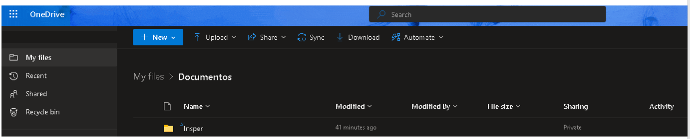

Siga os passos a seguir:

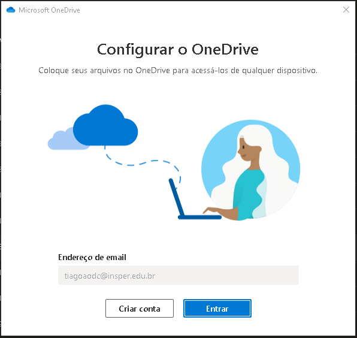

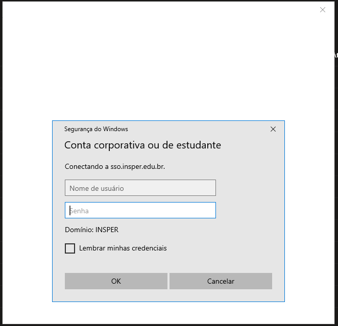

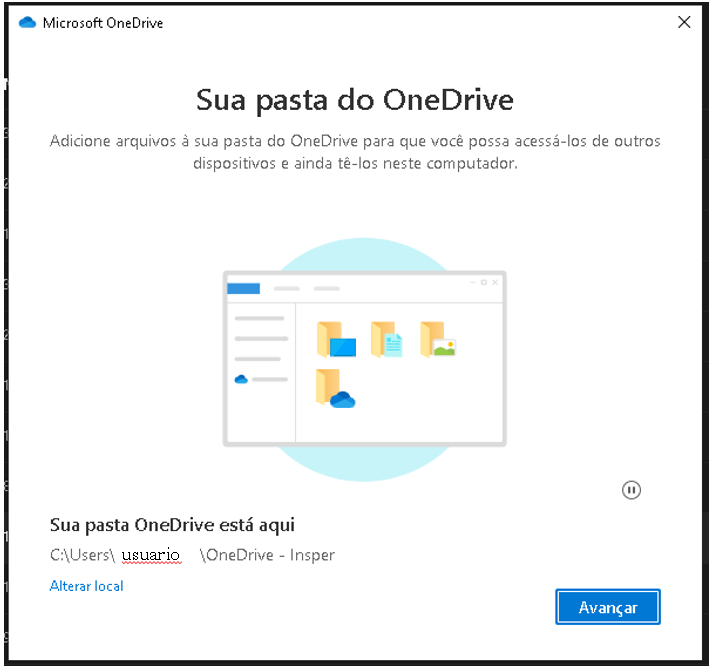

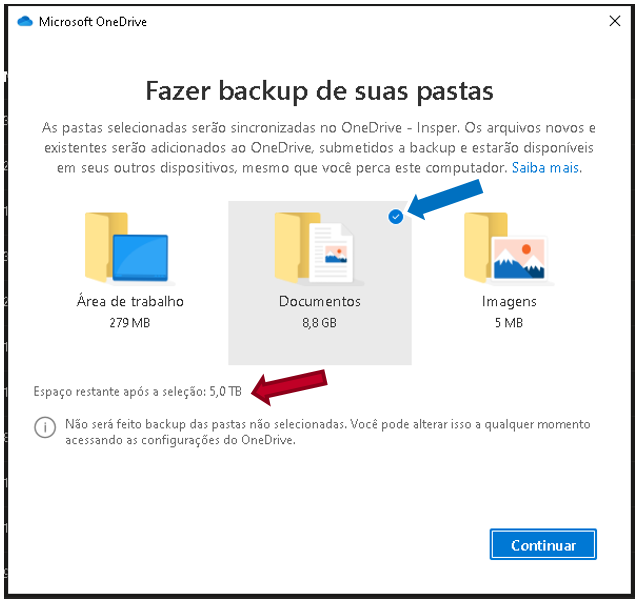

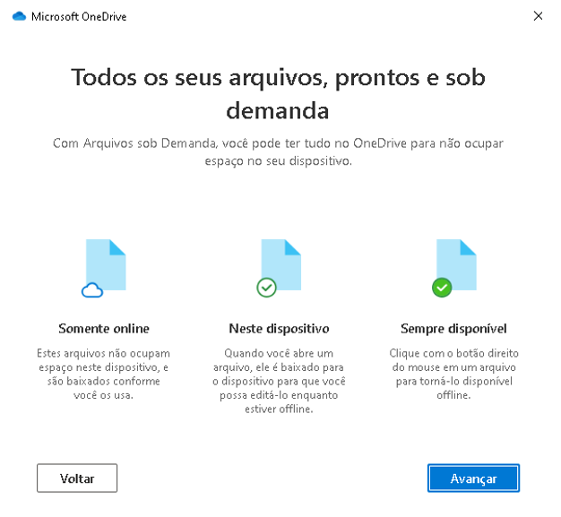

Depois de concluir os próximos passos você terá uma estrutura de pastas como essa:

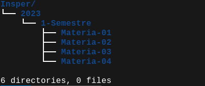

Apartir de agora, seus arquivos serão sincronizados automaticamente com o seu OneDrive.

## Instalando o Pacote Office no seu Notebook

Logado na sua conta Microsoft, acesse o site abaixo:

[Sign in to your account](https://portal.office.com/Account#installs)

Clicar em Install Office e Salvar o arquivo de setup no computador (local).

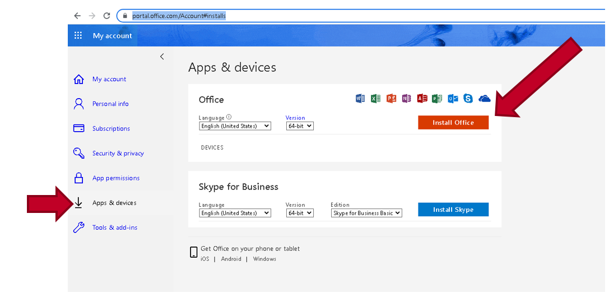

Clicar sobre o executavel OfficeSetup.exe

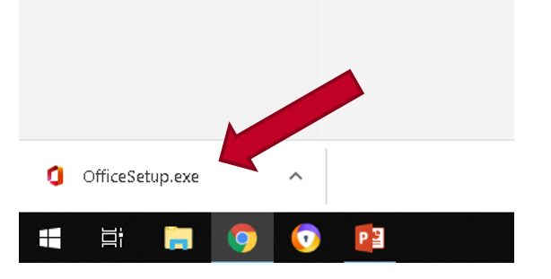

Finalizando a instalação, você terá no seu computador o Pacote Office, bom uso!