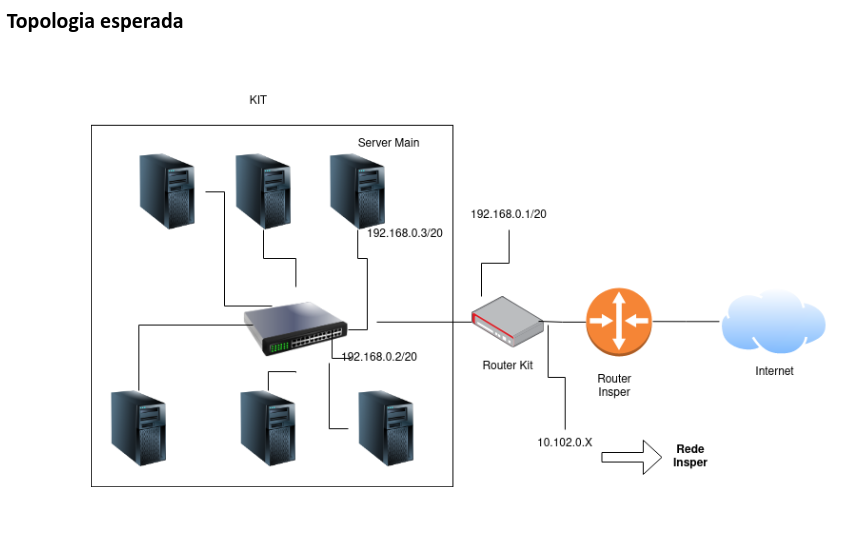
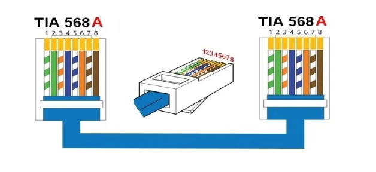
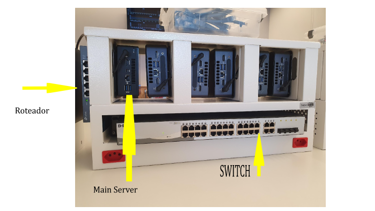

# Laboratório de Cabeamento - 1 Aula

## Objetivos:

Conhecer os padrões mais utilizados para o cabeamento de rede e a confecção de um cabo de rede. Ainda neste laboratório deverão ser configurados todos os equipamentos que compõem o kit de trabalho de cloud computing. 

Pré-requisitos:

* Ethernet . [Tanenbaum - seções 2.2.2 Par trançado, 4.3.1 Cabeamento Ethernet, 4.3.8 Ethernet de gigabit].

## Cloud Computing

O kit contém os seguintes itens:

 * Roteador TP-LINK TL-R470T+
 * Switch DLink DSG-1210-28 de 28 portas
 * 6 hosts

OBS: As senhas do roteador está no inventário do seu kit e a do switch está no manual oficial.

{width=600}

## Passo 1 – Cabo de rede (Patch cord)

O primeiro deste exercício é a confecção do cabo de rede para a conexão de seu computador pessoal ao ambiente do seu kit. O padrão que será utilizado é o ANSI/TIA/EIA 568 que foi desenvolvido em 1991 pela EIA  (Electronics Industries Alliance) e pela TIA (Telecommunications Industry Association), para normatizar as ligações elétricas/eletrônicas de cabos de rede e sua conectorização. Em 1995 uma revisão é publicada a  ANSI/TIA/EIA 568A.

{width=600}

## Passo 2 – conexão dos hosts e roteador
  

{width=600}

* De Acordo com a imagem da topologia (primeira imagem), conecte todos os cabos de rede presentes em seu kit no switch, hosts e roteador;
* Utilize o cabo que você montou para interligar o seu notebook com o kit (conecte ele no switch);
* **Confira** as configurações de endereçamento do roteador. Acesse pelo navegador o endereço 172.16.0.1
* Entre no dashboard de setup do switch e também analise as configuraçoes. Faça uma pesquisa na Internet em busca do manual do switch. Leia o manual e configure o IP.

### Lapidando o projeto

Agora realize as seguinte modificações (se preciso, leia os manuais):

  * Altere o IP do Roteador para 192.168.0.1/20.
  * Altere o IP do Switch para 192.168.0.2/20.
  * Modifique o DHCP server para utilizar a subrede 192.168.0.0/20.
