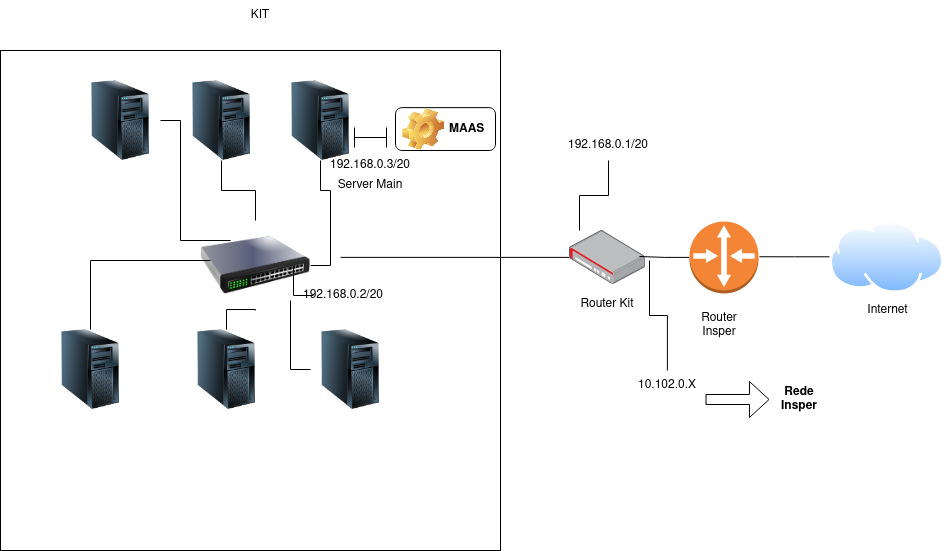

# Bare Metal

## Objetivos:

* Entender os conceitos básicos sobre uma plataforma de gerenciamento de hardware.
* Introduzir conceitos básicos sobre redes de computadores.

Pré-requisitos:

* Realizar a leitura sobre o MaaS. [https://maas.io/].
* Realizar a leitura sobre redes de computadores. [Tanenbaum - seções 1.4, 4.0 e 5.6]


??? info 
    **DIVISÃO DO ROTEIRO** 
    
    O Roteiro é dividido em 2 partes principais.
    
    * Criando a Infraestrutura (Nuvem Bare-metal)
    * Usando a infraestrutura: Django em Nuvem Bare-Metal


## Material

O grupo irá contar com os seguintes itens no kit:

  * 1 NUC (main) com 10Gb e 1 SSD (120Gb)
  * 1 NUC (server1) com 12Gb e 1 SSD (120Gb)
  * 1 NUC (server2) com 16Gb e 2 SSD (120Gb+120Gb)
  * 3 NUCs (server3, server4 e server5) com 32Gb e 2 SSD (120Gb+120Gb)
  * 1 Switch DLink DSG-1210-28 de 24 portas
  * 1 Roteador TP-Link TL-R470T+

### Rede

Cada grupo tem a disposição um ponto de rede (cabo preto) com saída para a rede interna da faculdade.

Requisitos de projeto:

  * Sua rede deverá estar **segregada fisicamente** da rede do Insper.
  * Todos os equipamentos estarão conectados e possuem acesso à Internet.
  * As NUCs **server2**, **server3** e **server4**, **server5** estarão conectados à rede com duas interfaces de rede, uma interna e uma externa USB (NIC).
  * A NUC **main** e a **server1** estarão conectadas à rede com uma interface de rede (interna).

### **Tarefa:** Realize as conexões de rede. Utilize o diagrama fornecido.

Cada kit possui um IP de entrada, fornecido no inventário do kit.

## QUESTOES-1

```

  1. Qual a topologia da sua rede? Quais outras topologias existem? 
  2. Quais casos uma rede ter mais de 1 gateway?
  3. Quais as consequências de utilizar um DNS externo (Por exemplo: 8.8.8.8) em uma rede privada?
  4. O Switch estava originalmente em qual rede? Quantos IPs tem essa rede? 
  5. Quando acessou o roteador pela primeira vez ele estava na *Classe C*. Quantas classes existem e qual é classe da rede do main? 

```  


### Senhas - IMPORTANTE

**Todas as senhas do seu sistema devem seguir o seguinte critério:**

  * utilizar a palavra 'cloud' + a letra do kit minúscula.
  * Por exemplo: 'cloudz' é a senha padrão do kit Z.
  * Usar a mesma senha para todos os serviços que exigem cadastramento
  * **NÃO** alterar nenhuma senha que já esteja pré-cadastrada.


## QUESTOES-2

```

  1. Quantos IPs utilizáveis estão disponíveis na subrede 192.168.0.0/20? Todos os IP são utilizáveis?
  2. Qual a diferença entre um IP público e um IP privado?
  3. Qual a classe utilizada na rede interna do Insper? E na sua rede?

```

# **Criando a Infraestrutura (Nuvem Bare-metal)**

* Consulte o diagrama abaixo "H1 - Diagrama"

{width=600}

### Instalando o Ubuntu

Procure tutoriais de como instalar o Sistema Operacional **Ubuntu server**, utilize o pen drive da caixa do seu KIT.

  * Instale o Ubuntu Server 20.04 LTS na NUC main:
    * hostname: main
    * login: cloud
    * senha: (cloud + letra do kit)
    * IP fixo: 192.168.0.3

### Instalando o MaaS

  * Verifique se ele consegue pingar '8.8.8.8'. Se não conseguir, descubra como rotear os pacotes corretamente.
  * Verifique se ele consegue pingar 'www.google.com'. Se não conseguir, descubra como resolver as urls corretamente.
  * \$ sudo apt update && sudo apt upgrade -y
  * Vá tomar um café. :coffee:
  * \$ sudo snap install maas
  * Tenho certeza que você não leu os pré-requisitos, ao invés do café :coffee: dá uma lida na documentacao pedida no comeco do roteiro :book:
  * \$ sudo snap install maas-test-db

### Configurando o MaaS

  * Inicializando o MaaS:
    * \$ sudo maas init region+rack
    * \$ sudo maas createadmin
      * use o login **cloud**
      * use a senha padrão da disciplina
      * deixe a chave vazia
  * Gerando um par de chaves para autenticação.
    * \$ ssh-keygen -t rsa
    * use senha vazia dessa vez
    * \$ cat ./.ssh/id_rsa.pub
    * copie a chave gerada
  * Agora vamos acessar o Dashboard do MaaS: 
    * ele estará disponível em http://192.168.0.3:5240/MAAS.
    * login
    * configure um DNS Forwarder com o DNS do Insper (DNS Externo que o seu roteador encherga).
    * Importe as imagens do **Ubuntu 20.04 LTS e 18.04 LTS**.
    * Faça o *upload* da chave copiada no terminal SSH.
    * Em Settings | General:
      * Global Kernel Parameters: net.ifnames=0 (sem espaços)

#### Chaveando o DHCP

  * Explore as configurações do MaaS. Habilite o DHCP na subrede pelo MaaS Controller.
    * **ALTERE** o Reserved Range para **iniciar** em 192.168.11.1 e **acabar** em 192.168.14.255.
  * Deixe o DNS da subnet em branco!
  * Desabilitar o DHCP no roteador.


#### Comissionando servidores

  * Com a folha do inventário do Kit (blackboard), cadastre os hosts (machines) disponíveis.
  * Altere a opção **Power Type** para **Intel AMT** e preencha segundo a tabela da folha.
  * As NUCs irão comissionar automaticamente, realizando o boot via PXE na rede.
  * :tea: **hora do Chá**, só aliviar o estômago um pouco. Chá também tem cafeína.
  * Todos os nós devem aparecer com o status **Ready**. Verificar se as características de hardware (cpu, memória, SSD e rede) foram detectados com sucesso.
  * Adicionar o Roteador como devices no Dashboard do MaaS

**Atenção**: verificar se as interfaces de rede se chamam **eth0** (placa rede padrão com PXE) e eth1 (NIC usb). Verificar o Global Kernel Parameters, **apagar o nó e reiniciar o processo caso algo esteja errado**.

## QUESTOES-3

```
  1. Por que Desabilitar o DHCP do roteador?
  2. Descreva o processo PXE Boot? Qual a sua grande vantagem em um datacenter real?
  3. Analisando em um aspecto mais amplo, quais outras funcionalidades do MaaS podem ser úteis no gerenciamento de **bare metal**? 

```  

## Fazendo Acesso Remoto ao seu KIT

De acordo com as aulas teóricas, vamos realizar um **NAT** para permitir o acesso externo **"Rede Wi-fi Insper"** do seu computador ao servidor **MAIN**.

A meta é conseguir conectar no servidor principal **"main"** utilizando a porta 22.

Se não lembrar das aulas teóricas, pesquise por como fazer NAT no Roteador do seu KIT. 

[LINK-documentacao](https://www.tp-link.com/br/support/download/tl-r470t+)


# **Usando a infraestrutura:** 
## Django em Nuvem Bare-Metal

### Primeiro Deploy

Vamos realizar um deploy manual de uma aplicação simples em Django em nossa nuvem MaaS.

Antes de começar, realize um pequeno ajuste no DNS server:

* Adicione também o endereço 8.8.8.8 nas configurações de **DNS forwarder** no Dashboard do MaaS
* Dentro da aba Subnets, clicar na subnet 192.168.0.0/20 e editar a Subnet summary colocando o DNS do Insper - 172.20.129.131

### Primeira parte: Banco de Dados

Postgres é um servidor de banco de dados versátil e de fácil manejo. Muito usado em projetos Opensource.

* Acesse o Dashboard do MaaS e realize o deploy do Ubuntu 20.04 no server1.
* Acesse o terminal do server1 via SSH:
  * \$ sudo apt update
  * \$ sudo apt install postgresql postgresql-contrib -y
* Ainda no terminal do server1, crie agora um usuário para a aplicação:
  * \$ sudo su - postgres
  * \$ createuser -s cloud -W
  * Usar a senha: cloud
* Crie um database para a aplicação:
  * \$ createdb -O cloud tasks
* Exponha o serviço para acesso:
  * \$ nano /etc/postgresql/12/main/postgresql.conf
  * Remova o comentário e substitua a string da linha para aceitar conexões remotas:
```
  listen_addresses = '*'
```
  * \$ nano /etc/postgresql/12/main/pg_hba.conf
  * Adicione a linha que libera qualquer máquina dentro da subnet do kit:
```
  host    all             all             192.168.0.0/20          trust
```
* Saia do usuário postgres
* Libere o firewall:
  * \$ sudo ufw allow 5432/tcp
* Reinicie o serviço:
  * \$ sudo systemctl restart postgresql

:robot: *Será que é possível automatizar esse processo* :question:

### Parte II: Aplicação Django

De volta ao maas, vamos subir uma aplicação ORM Django pré produzida. No lugar de [login], utilize o usuário criado para administrar o MaaS.

* Peça uma máquina direto do cli no terminal agora:
  * \$ maas login [login] http://192.168.0.3:5240/MAAS/
  * Buscar o token no dashboard dentro das configurações do usuário.
* Solicite a reserva da máquina para o MaaS:
  * \$ maas [login] machines allocate name=server2
  * Anote o campo system_id do json resultante.
* Realize o deploy via linha de comando, usando o cli:
  * \$ maas [login] machine deploy [system_id]
* Café :coffee: ... Aguarde a máquina finalizar e entre via ssh nela.
* No SSH do server2:
  * \$ git clone https://github.com/raulikeda/tasks.git
  * Entre no diretorio tasks.
  * \$ ./install.sh
  * reboot e aguarde
* Teste acessando o serviço na porta 8080 no terminal do maas:
  * \$ wget http://[IP server2]:8080/admin/

Para acessar o serviço no seu browser seria necessário fazer um NAT no roteador. Porém podemos considerar esse serviço como sendo temporário e podemos usar uma outra forma de expor o serviço para fora do kit usando SSH tunnel:

* Desconecte do SSH do maas
* Reconecte novamente usando:
  * \$ ssh cloud@10.103.0.X -L 8001:[IP server2]:8080
* O comando acima irá criar um tunel do serviço do server2 na porta 8080 para o seu localhost na porta 8001 usando a conexão SSH.
* Note que é importante que a porta 8001 não esteja sendo usada no seu computado.
* Acesse então o endereço no browser: http://localhost:8001/admin/
  * Login Django: cloud
  * Senha Django: cloud

Tome um tempo olhando o conteúdo do arquivo install.sh. Ele automatiza as tarefas de instalação usando shell script.

Note que a utilização do maas-cli no terminal substitui a utilização do dashboard. Tome um tempo explorando:

  * \$ maas [login] help commands

Caso tenha interesse na aplicação django: https://docs.djangoproject.com/pt-br/3.1/intro/tutorial01/


## Finalizando

## QUESTOES-4

```

  1. O que é e como funciona o NAT? 
  2. O que é e como funciona a VPN? 
  3. O que deveria ser feito para você conseguir acessar o Maas da sua casa sem VPN?

```

## QUESTOES Finais --- Afererindo conceitos e habilidades

```

  1. O que significa LTS? Por que isso importa para uma empresa?
  2. O que é IPv6? Qual a importância da migração?
  3. A literatura preconiza que o Modelo de Rede Internet possui 5 camadas, quais são elas e quais camadas foram envolvidas nesse capítulo?
  4. A literatura mais antiga discorre sobre o Modelo de Rede OSI de 7 camadas. Explique a diferença entre os dois modelos.
  5. O que é e para que serve um gerenciador de Bare Metal? 
  6. O que é um MAC address?
  7. O que é um IP address? Como ele difere do MAC address?
  8. O que é CIDR? Qual o papel da subrede? 
  9. O que são DHCP, DNS e gateway?

```

## **Conclusão:** *SOMENTE PARA PENSAR* :exclamation: :exclamation: :exclamation:

```

 Descreva como o MaaS poderia ser utilizado em um datacenter real (com muitos servidores) e como seria um processo alternativo sem essa ferramenta. Ainda, é possível e *SIMPLES* realizar a implantação de uma aplicação usando o MaaS?

```
