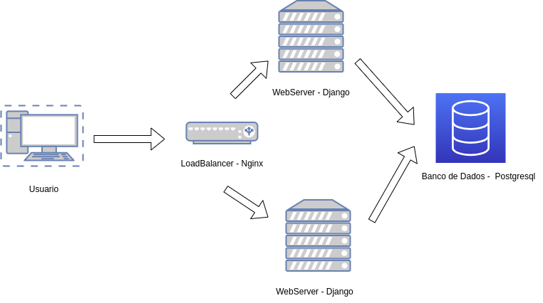

# Private cloud

Objetivos

1. Entender os conceitos básicos de Private Cloud.
1. Aprofundar conceitos sobre redes virtuais SDN.

Pré-requisitos:

1. Terminar o capítulo anterior (Juju)
1. Realizar a leitura sobre o Openstack. [https://www.openstack.org/].
1. Realizar a leitura sobre o Openstack. [Jackson et al - Cap. 1 até Cap. 5]


??? info 
    **DIVISÃO DO ROTEIRO** 
    O Roteiro é dividido em 2 partes principais.
    
      * Criando a Infraestrutura (Nuvem VM) - Servidor Virtual Privado (VPS)
      * Uso da Infraestrutura: Django na Nuvem VM criada


## Criando a Infraestrutura (Nuvem VM) - Servidor Virtual Privado (VPS)

Nesse roteiro vamos instalar um conjunto de aplicações denominado **Openstack** que vai permitir distribuirmos *virtual machines* usando os nós disponíveis no kit.

Até o momento usamos o *mass* para orquestrar o *bare metal* e o *juju* para cuidar do *deployment* de aplicacoes (exemplo Wordpress). E agora vamos utilizar o Openstack para criar VMs e distribuir os serviços em todas as máquinas kit com maior eficiencia.

### Instalando - Openstack Canonical Distro

* Faça o *download* do charm **Openstack Base** no maas:
  * ```$ charm pull cs:openstack-base```
* Dentro do diretório criado, edite o arquivo *bundle.yaml*:

  * *identifique* quantas máquinas serão alocadas.
  * *verifique* cada um dos serviços que serão instalados e em quais máquinas.
  * sete o nome do adaptador de rede, *br-ex:eth1* na variável *data-port*. **Cuidado para não errar** (seguir https://charmhub.io/openstack-base)

```
variables:
  openstack-origin:    &openstack-origin     cloud:focal-yoga
  data-port:           &data-port            br-ex:eth1
  worker-multiplier:   &worker-multiplier    0.25
  osd-devices:         &osd-devices          /dev/sdb /dev/vdb
  expected-osd-count:  &expected-osd-count   3
  expected-mon-count:  &expected-mon-count   3
```

* Reservar (Allocate) a máquina "server2" no maas.
* Instale o bundle customizado:
  * ```$ juju deploy ./bundle.yaml```
* Hora da leitura na documentacao pedida no comeco do roteiro :book: :book: :book:

!!! warning 
    Provavelmente ocorreu um erro no **deploy**.
    ??? Conceito importante:
        Ao contrário do Ansible, Juju necessita de uma máquina exclusiva para controlar todo o deploy. Essa máquina é alocada automaticamente durante o bootstrap e controlará todo o deploy.
        Logo você precisa fazer o bootstrap de um novo controlador no server1. 


<!-- * Importante, execute comando para usar o LXD 4.24 (existe um BUG em andamento no LXD 5 - https://bugs.launchpad.net/juju-core/+bug/1565872) 
  * ```$ juju model-config lxd-snap-channel=4.24/stable``` -->
* Vocês já sabem o que fazer agora: utilizar o comando abaixo para ficar de olho no status do Juju:
  * ```$ watch -n 2 -c "juju status --color"```

:clock: :timer:
Enquanto aguarda a instação até a indicação **'certificates' awaiting server certificate data** e até que o serviço **Vault** esteja bloqueado. Responda abaixo:

!!! exercise
    QUESTOES-1

    1. Conforme visto no arquivo de instalação, os serviços são instalados usando LXD nos nodes. O que é LXD?
    1. Baseado na distribuição do bundle.yaml e no juju status, faça um desenho de como é a sua arquitetura de solução: 
      * um retângulo grande para cada máquina física.
      * coloque um retângulo para cada lxd (container) dentro da respectiva máquina.
      * dentro de cada retângulo, escreva o nome do serviço.
      * realize a ligação entre os serviços baseando-se nas relações.
    1. *Vault* é um servidor de *secrets*. Como ele funciona e para o que ele é usado?


### Abrindo o cofre

Para dar prosseguimento, precisamos instalar um certificado válido dentro do Vault, para isso precisamos fazer uma operação de *unseal*:

* Instalando o cli do Vault e configurando-o:
  * ```$ sudo snap install vault```
  * ```$ export VAULT_ADDR="http://<IP of vault unit>:8200"```
* Gerando :
  * ```$ vault operator init -key-shares=5 -key-threshold=3```
  * Vocês receberão 5 *Unseal Keys* e 1 *Initial Root Token*. Copie e reserve.
* Removendo o selo, repita a operação com 3 keys diferentes:
  * ```$ vault operator unseal <Unseal Key>```
* Autorizando o charm (esse passo precisa ser feito em 10 minutos):
  * ```$ export VAULT_TOKEN=<Initial Root Token>```
  * ```$ vault token create -ttl=10m```
  * anote o *token* gerado pelo comando e use abaixo.
  * ```$ juju run-action --wait vault/leader authorize-charm token=<token>```
* Finalmente, gerando o certificado:
  * ```$ juju run-action --wait vault/leader generate-root-ca```

Espere até **TODOS** os servicos ficarem com o Status "active".

### Configurando o Openstack

Chegou a hora de configurar o serviço que controla as VMs (Nova), os volumes de disco (Cinder) e a estrutura de rede virtual (Neutron). O primeiro passo é carregar as variáveis de ambiente e autenticar (Keystone) no sistema.

Ainda, montaremos o nosso servidor de imagens (Glance), que utiliza o *Object Storage* (Ceph) para armazenamento. O sistema ainda conta com um dashboard (Horizon), um cluster de banco de dados (Mysql Inno Cluster) e um servidor de filas (RabbitMQ) como apoio.

### Usando como **base** a página do charm instalado (https://jaas.ai/openstack-base/), LEIA O DOCUMENTO INTEIRO ANTES DE INICIAR OS COMANDOS.
### Acesse o Horizon (*dashboard*) como administrador

!!! Dica

    O Domain name é : admin_domain


!!! exercise
    CheckPoint-1


    1. De um print das Telas abaixo:
      1. Do Dashboard do **MAAS** com as máquinas.
      1. Da aba compute *overview* no **OpenStack**.
      1. Da aba compute *instances* no **OpenStack**.
      1. Da aba network *topology* no **OpenStack**.


  * Prestem muita atenção nos passos! Não copie e cole comandos sem verificar os argumentos. Começe a partir da seção *Install the OpenStack clients*
  * Instale o client do Openstack no maas via snap. 
  * Carregue as credenciais em *openrc* e verifique os serviços:
  * ```$ openstack service list```
  * Faça pequenos ajustes na rede:
    * ```$ juju config neutron-api enable-ml2-dns="true"```
    * ```$ juju config neutron-api-plugin-ovn dns-servers="192.168.0.1"```
  * Importe a imagem do Ubuntu Focal e Bionic. Você precisará procurar a imagem do Bionic.
  * Configure a rede externa. Usar uma faixa de alocação entre 192.168.7.0 e 192.168.8.255.
  * Crie a rede interna e o roteador. Usar a subnet 192.169.0.0/24. **Não** use DNS.
  * Analise o comando:
    * ```$ openstack flavor create --help```
  * Crie os flavors (instance type) - **SEM *ephemeral disk***:
    * m1.tiny: 1 vcpu/1Gb RAM/20Gb disk
    * m1.small: 1 vcpus/2Gb RAM/20Gb disk
    * m1.medium: 2 vcpus/4Gb RAM/20Gb disk
    * m1.large: 4 vcpus/8Gb RAM/20Gb disk
  * **Importe** (upload) um key-pair, usando *public key* (id_rsa.pub) do próprio MaaS.
* Acesse o Horizon (*dashboard*) como administrador:
  * Adicione a liberação do SSH e ALL ICMP no *security group default*.
  * Verifique se a topologia de rede faz sentido. Ela deve ser semelhante ao projeto da sua rede física, porém com mais um nível dentro. Essa rede não existe fisicamente, é tudo virtual.
  * Dispare uma instância m1.tiny com o nome *client* e **sem** *Novo Volume*.
  * Aloque um floating IP para a instância.
  * Teste a conexão SSH! Em caso de erro, volte e verifique se as etapas anteriores estão corretas.


!!! exercise
    CheckPoint-2


    1. De um print das Telas abaixo:
      1. Do Dashboard do **MAAS** com as máquinas.
      1. Da aba compute *overview* no **OpenStack**.
      1. Da aba compute *instances* no **OpenStack**.
      1. Da aba network *topology* no **OpenStack**.
    1. Enumere as diferencas encontradas entre os prints das telas no Checkpoint1 e o Checkpoint-2.
    1. Explique como cada recurso foi criado.   


### Configurando imagens do Ubuntu para uso (Metadata)

* Na máquina main, vamos adicionar o serviço Glance Simplestreams.
* ```juju deploy glance-simplestreams-sync --to 0```
* ```juju add-relation glance-simplestreams-sync:identity-service keystone:identity-service```
* Execute o comando ```juju run-action glance-simplestreams-sync/0 sync-images --wait``` e aguarde a conclusão acompanhando via *juju status*.


### Escalando os nós


Vamos adicionar o openstack no cluster como nó de *computing* e *block storage*.

* Verfique no *Dashboard* do MaaS se ainda há uma máquina disponível (máquina que reservamos/allocated). Faça o release da máquina que está ALLOCATED (cuidado para não errar!)
* Instale o hypervisor, realizando o *deploy* na máquina:
  ```$ juju add-unit nova-compute```
* Anote o número da máquina adicionada no status e instale o block storage:
  ```$ juju add-unit --to <machine-id> ceph-osd```


!!! exercise
    QUESTOES-2

    1. Qual a função do Glance? O que o comando abaixo faz?
      ```juju run-action glance-simplestreams-sync/0 sync-images --wait```
    1. Para que serve o Metadata gerada pelo glance?
    1. Faça um desenho de como é a sua arquitetura de rede, desde a sua conexão com o Insper até a instância alocada.
    1. O que é um Hypervisor? Qual o hypervisor do Openstack, da AWS e da Azure?


## Uso da Infraestrutura: Django na Nuvem VM criada

Agora conseguimos corrigir o erro apontado na conclusão do H2, levantando a mesma aplicação django mas sem precisar sacrificar 4 máquinas inteiras.

**Tarefa**: Levantar a aplicação django do Roteiro1 até o Roteiro2 (com Nginx) em cima das maquinas virtuais do Openstack.

TOPOLOGIA:

{width=600}

!!! exercise

    1. Escreva um relatório dos passos utilizados.
    1. Anexe fotos e/ou diagramas contendo: arquitetura de rede do Django dentro do Openstack* (**Dica: use o dashboard do Openstack**), lista de VMs utilizadas com nome e IPs alocados, foto do Dashboard Django conectado na máquina Nginx/LB.


!!! exercise
    QUESTOES-3

    1. Dado que vocês trabalharam com Nuvem Pública e com Nuvem Privada, descreva com detalhes como você montaria uma Nuvem Híbrida. Como seria a troca de dados?
    1. É possível somar todo o hardware disponível e disparar uma instância gigante (ex: mais memória do que disponível na melhor máquina)? Discorra sobre as possibilidades.
    1. Cite e explique **pelo menos** 2 circunstâncias em que a *Private Cloud* é mais vantajosa que a *Public Cloud*.
    1. Openstack é um Sistema Operacional? Descreva seu propósito e cite as principais distribuições?
    1. Quais são os principais componentes dentro do Openstack? Descreva brevemente suas funcionalidades.

