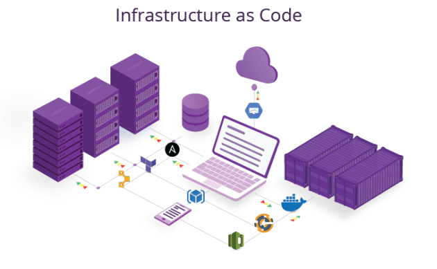
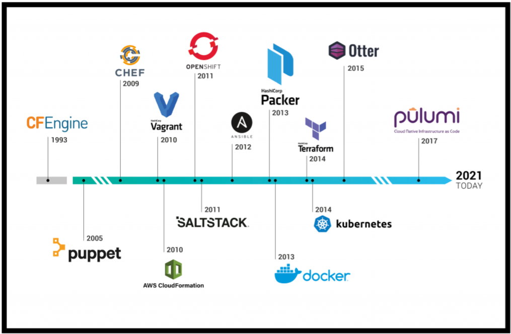
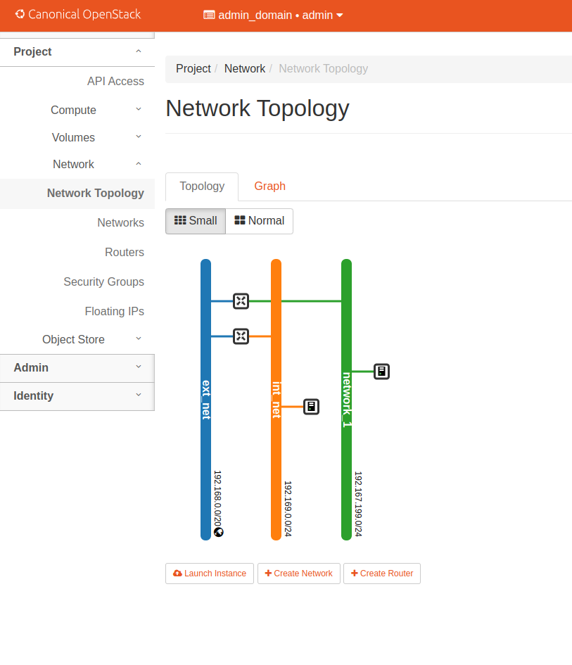

# SLA, DR e IaC

Objetivos

1. Entender os conceitos básicos Infraestrutura como código.
1. Entender os conceitos básicos sobre SLA e DR.

Pré-requisitos:

Terminar o capítulo anterior (Openstack)
Realizar a leitura [Kavis - Cap 11 e Cap 13]


??? info 
    **DIVISÃO DO ROTEIRO** 
    O Roteiro é dividido em 3 partes principais.

      * Entendendo IaC - Visão Geral
      * Criando a Infraestrutura utilizando IaC
      * Criando um plano de Disaster Recovery e SLA (QUESTOES)

## IaC Visão geral

Infraestrutura como código (IaC) é o gerenciamento e provisionamento de infraestrutura por meio de código, em vez de processos manuais.

Utilizando o IaC, é possível criar arquivos de configuração que contenham especificações de infraestrutura, o que facilita a edição e distribuição das configurações. Também garante que você sempre forneça o mesmo ambiente. Ao codificar e documentar suas especificações de configuração, o IaC auxilia no gerenciamento de configuração e ajuda a evitar alterações de configuração não documentadas. O IaC evoluiu para lidar com a deriva ambiental em dutos de liberação. Sem o IaC, as equipes teriam que manter as configurações do ambiente de implantação separadamente. Com o tempo, cada ambiente se torna um "floco de neve", uma configuração única que não pode ser replicada automaticamente. Inconsistências entre ambientes podem causar problemas de implantação. O gerenciamento e a manutenção da infraestrutura envolvem processos manuais que são propensos a erros e difíceis de rastrear.


{width=600}

### Reforçando

O IaC evita a configuração manual e garante consistência ao expressar o estado desejado do ambiente por meio de código bem documentado em formatos como por exemplo o JSON. A implantação de infraestrutura com IaC é repetível e evita problemas de tempo de execução causados ​​por configurações quebradas ou dependências ausentes. 

**Para fazer alterações, você precisa editar a origem, não o destino**.

A idempotência (a capacidade de uma determinada operação produzir sempre o mesmo resultado) é um princípio fundamental da IaC. O comando deploy sempre define o ambiente de destino com a mesma configuração, independentemente do estado inicial do ambiente. A idempotência é alcançada configurando automaticamente os destinos existentes ou excluindo os destinos existentes e recriando novos ambientes.

### O que é Terraform em Infraestrutura como Código?

É uma das possiveis ferramentas para IaC.

O mercado de Infraestrutura como Código amadureceu ao longo dos anos. Há uma grande variedade de ferramentas, oferecendo diferentes recursos.

{width=600}

Terraform é a infraestrutura da HashiCorp como ferramenta de código. Ele permite que você defina recursos e infraestrutura em arquivos de configuração declarativos legíveis por humanos e gerencie o ciclo de vida de sua infraestrutura. O uso do Terraform tem várias vantagens em relação ao gerenciamento manual de sua infraestrutura:

1. O Terraform pode gerenciar a infraestrutura em várias plataformas de nuvem.
1. A linguagem de configuração legível por humanos ajuda você a escrever código de infraestrutura rapidamente.
1. O estado do Terraform permite rastrear alterações de recursos em todas as suas implantações.
1. Você pode confirmar suas configurações no controle de versão para colaborar com segurança na infraestrutura.


:zap: :zap: :zap: Para implantar infraestrutura com o Terraform:

    * Scope         - Identifique a infraestrutura para o seu projeto.
    * Author        - Escreva a configuração para sua infraestrutura.
    * Initialize    - Instale os plugins que o Terraform precisa para gerenciar a infraestrutura.
    * Plan          - Visualize as alterações que o Terraform fará para corresponder à sua configuração.
    * Apply         - Faça as alterações planejadas.


### Instalar Terraform

=== "Ubuntu/Debian"

    * `wget -O- https://apt.releases.hashicorp.com/gpg | gpg --dearmor | sudo tee /usr/share/keyrings/hashicorp-archive-keyring.gpg`
    * `gpg --no-default-keyring --keyring /usr/share/keyrings/hashicorp-archive-keyring.gpg --fingerprint`
    * `echo "deb [signed-by=/usr/share/keyrings/hashicorp-archive-keyring.gpg] https://apt.releases.hashicorp.com $(lsb_release -cs) main" | sudo tee /etc/apt/sources.list.d/hashicorp.list`
    * `sudo apt update && sudo apt install terraform`

=== "CentOS/RHEL"

    * `sudo yum install -y yum-utils`
    * `sudo yum-config-manager --add-repo https://rpm.releases.hashicorp.com/RHEL/hashicorp.repo`
    * `sudo yum -y install terraform`

=== "Windows/FreeBSD/OpenBSD/Solaris"

    * `Ir na pagina oficial e baixar o pacote binário`
    * `https://www.terraform.io/downloads`

=== "macOS"

    * `brew tap hashicorp/tap`
    * `brew install hashicorp/tap/terraform`


## Criando a Infraestrutura utilizando IaC
  
Agora vamos ver como isso funciona. Até agora você acessou o dashboard ou utilizou a interface de linha de comando (CLI) para criar rede, subrede, instancia, roteador e outros recursos.

* Vamos criar a topologia abaixo via código.


{width=600}

O Terraform conta com arquivos .tf, que definem a infraestrutura. 

O Terraform sabe o que é implantado por meio do arquivo de estado. Este estado é armazenado por padrão em um arquivo local chamado “terraform.tfstate”. Também pode ser armazenado remotamente, o que funciona melhor em um ambiente de equipe. 

O Terraform permite vários provedores, normalmente inicializados em um arquivo chamado provider.tf.

A estrutura de pastas ficará conforme figura abaixo:


{width=600}

* Crie a estrutura :exclamation: :exclamation:

* Dentro da pasta **terraform** crie os arquivos abaixo:

provider.tf

```
# Terraform Openstack deployment
# Author: Tiago Demay - tiagoaodc@insper.edu.br


# Define required providers
terraform {
required_version = ">= 0.14.0"
  required_providers {
    openstack = {
      source  = "terraform-provider-openstack/openstack"
      version = "~> 1.35.0"
    }
  }
}


# Configure the OpenStack Provider

provider "openstack" {
  cacert_file         ="/home/cloud/snap/openstackclients/common/root-ca.crt"
  auth_url            = "https://192.168.0.120:5000/v3"
  region              = "RegionOne"
  user_name           = "admin"
#  password            = "PASSWORD_USER"
}


```

instance.tf
```
resource "openstack_compute_instance_v2" "instancia" {
  name            = "basic"
  image_name      = "bionic-amd64"
  flavor_name     = "m1.small"
  key_pair        = "mykey"
  security_groups = ["default"]

  network {
    name = "network_1"
  }

  depends_on = [openstack_networking_network_v2.network_1]

}

```

network.tf
```
resource "openstack_networking_network_v2" "network_1" {
  name           = "network_1"
  admin_state_up = "true"
}

resource "openstack_networking_subnet_v2" "subnet_1" {
  network_id = "${openstack_networking_network_v2.network_1.id}"
  cidr       = "192.167.199.0/24"
}

```

!!! info
    Alterar a variavel external_network_id = <"ID_EXT_NETWORK"> para o ID da sua rede externa, você pode encontrar esta informacão, acessando o Dashboard do Openstack ou via CLI openstack


router.tf

```
resource "openstack_networking_router_v2" "router_1" {
  name                = "my_router"
  admin_state_up      = true
  external_network_id = <"ID_EXT_NETWORK">
}

resource "openstack_networking_router_interface_v2" "int_1" {
  router_id = "${openstack_networking_router_v2.router_1.id}"
  subnet_id = "${openstack_networking_subnet_v2.subnet_1.id}"
}


```

## Criando um plano de Disaster Recovery e SLA (QUESTOES)


!!! exercise
    QUESTOES


    1. Qual o conceito por trás de Edge Computing? (Obs: Não é a rede de celular 2G)
    1. Você é o CTO (Chief Technology Officer) de uma grande empresa com sede em várias capitais no Brasil e precisa implantar um sistema crítico, de baixo custo e com dados sigilosos para a área operacional. 
    1. Você escolheria Public Cloud ou Private Cloud?
    1. Agora explique para ao RH por que você precisa de um time de DevOps.
    1. Considerando o mesmo sistema crítico, agora sua equipe deverá planejar e implementar um ambiente resiliente e capaz de mitigar possíveis interrupções/indisponibilidades. Para isso, identifiquem quais são as principais ameaças que podem colocar sua infraestrutura em risco, e descreva as principais ações que possibilitem o restabelecimento de todas as aplicações de forma rápida e organizada caso algum evento cause uma interrupção ou incidente de segurança. Para isso monte um plano de DR e HA que considere entre as ações:
        - Mapeamento das principais ameaças que podem colocar em riscos o seu ambiente.
        - Elenque e priorize as ações para a recuperação de seu ambiente em uma possível interrupção/desastre.
        - Como sua equipe irá tratar a política de backup?
        - Considerando possíveis instabilidades e problemas, descreva como alta disponibilidade será implementada em sua infraestrutura.