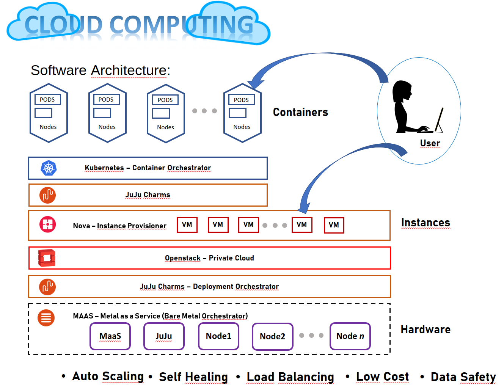
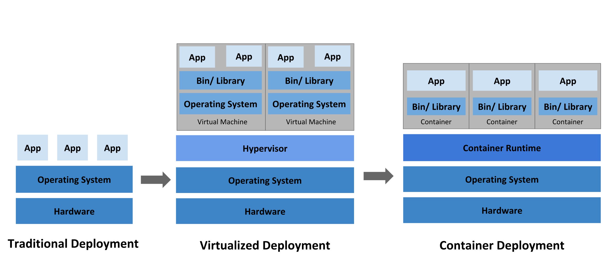
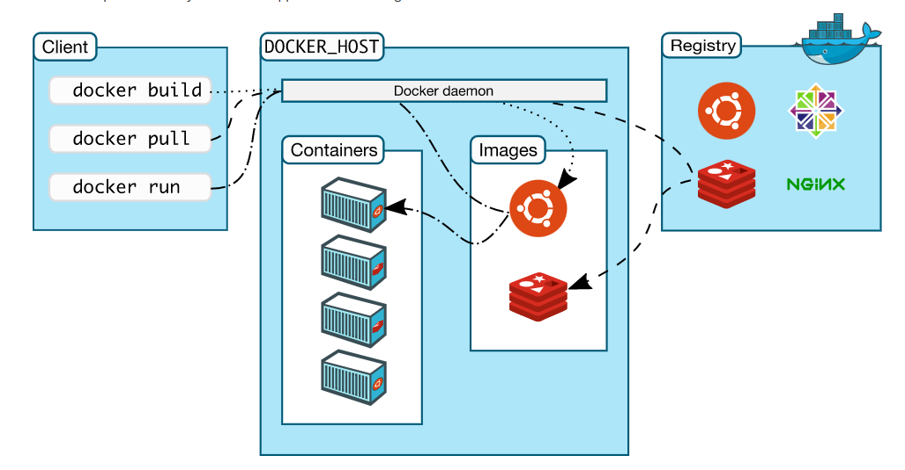
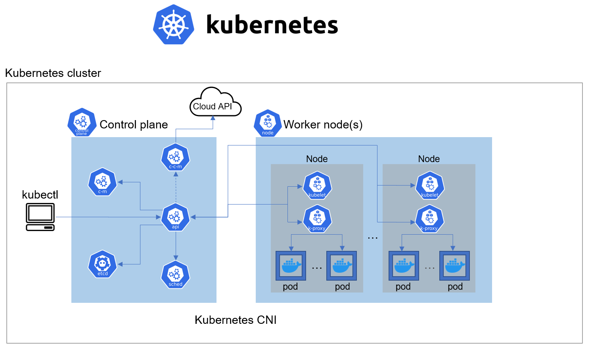

# Containers e K8s

Objetivos

1. Entender os conceitos básicos sobre Contêineres e seus Orquestradores.
1. Instalar o Octavia no Openstack
1. Integrar o Openstack e o Kubernetes


Pré-requisitos:

1. Terminar o capítulo anterior (SLA,DR e IaC)
1. Realizar a leitura sobre o Docker. [https://docs.docker.com/engine/docker-overview/].
1. Realizar a leitura sobre o Kubernetes. [https://kubernetes.io/docs/concepts/].
1. Realizar a leitura do Octavia. [https://docs.openstack.org/octavia/latest/].
1. Realizar a leitura do Barbican. [https://docs.openstack.org/barbican/latest/].
1. Realizar a leitura dos Charms. [https://jaas.ai/vault, https://jaas.ai/octavia, https://jaas.ai/barbican].

??? info 
    **DIVISÃO DO ROTEIRO** 
    O Roteiro é dividido em 3 partes principais.

      * Entendendo tipos de implantacoes - Visão Geral
      * Adicionando Octavia (Load Balancer) na Nuvem privada(Openstack)
      * Utilizando Docker e Kubernetes

## TARGET

### DO INICIO DO ROTEIRO 1 ATE ONDE CHEGAMOS NO FIM DESTE ROTEIRO

{width=600}

## Tipo de implantacoes

### Tradicional
Inicialmente, as organizações executavam aplicativos em servidores físicos. Os limites de recursos não podem ser definidos para aplicativos em servidores físicos, o que causa problemas de alocação de recursos. Por exemplo, se vários aplicativos estiverem sendo executados em um servidor físico, pode haver uma situação em que um aplicativo consuma mais recursos, resultando em um desempenho insatisfatório de outros aplicativos. A solução para isso é executar cada aplicativo em um servidor físico diferente. Mas isso não aumentou porque os recursos são subutilizados e é caro para as organizações manter muitos servidores físicos.

### Virtualizada

Como solução, a virtualização foi introduzida. Ele permite que você execute várias máquinas virtuais (VMs) na CPU de um único servidor físico. A virtualização permite que os aplicativos sejam isolados entre VMs e fornece um nível de segurança que as informações de um aplicativo não podem ser acessadas livremente por outro aplicativo.
A virtualização permite uma melhor utilização dos recursos em servidores físicos e uma melhor escalabilidade, pois os aplicativos podem ser facilmente adicionados ou atualizados, os custos de hardware são reduzidos e muito mais. Com a virtualização, você pode apresentar um conjunto de recursos físicos como um cluster de máquinas virtuais descartáveis.
Cada VM é uma máquina completa, executando todos os componentes, incluindo seu próprio sistema operacional, sobre hardware virtualizado.

### Conteinerizada

Os contêineres são pacotes leves do código do seu aplicativo, juntamente com dependências, como versões específicas de tempos de execução de linguagem de programação e bibliotecas necessárias para executar seus serviços de software.
Os contêineres facilitam o compartilhamento de recursos de CPU, memória, armazenamento e rede no nível dos sistemas operacionais e oferecem um mecanismo de empacotamento lógico no qual os aplicativos podem ser abstraídos do ambiente em que realmente são executados.

**Os contêineres virtualizam no nível do sistema operacional enquanto as VMs virtualizam no nível do hardware**

{width=600}


## Instalando e Configurando o Octavia (Loadbalancer para Openstack)

* No servidor Main:

Faça o download do arquivo loadbalancer-octavia.yaml no Github openstack-charmers/openstack-bundles

Entre na pasta openstack

Vamos pedir pro juju aplicar as modificacoes do bundle customizado com o overlay.

`juju deploy ./bundle.yaml --overlay loadbalancer-octavia.yaml`


### Vocês já sabem o que fazer agora, Ler a documentacao sobre K8S e Docker, mas de olho no status do Juju.


Agora vamos criar os certificados necessários.


```
mkdir -p demoCA/newcerts
touch demoCA/index.txt
touch demoCA/index.txt.attr

openssl genpkey -algorithm RSA -aes256 -pass pass:foobar -out issuing_ca_key.pem
openssl req -x509 -passin pass:foobar -new -nodes -key issuing_ca_key.pem \
    -config /etc/ssl/openssl.cnf \
    -subj "/C=US/ST=Somestate/O=Org/CN=www.example.com" \
    -days 30 \
    -out issuing_ca.pem

openssl genpkey -algorithm RSA -aes256 -pass pass:foobar -out controller_ca_key.pem
openssl req -x509 -passin pass:foobar -new -nodes \
        -key controller_ca_key.pem \
    -config /etc/ssl/openssl.cnf \
    -subj "/C=US/ST=Somestate/O=Org/CN=www.example.com" \
    -days 30 \
    -out controller_ca.pem
openssl req \
    -newkey rsa:2048 -nodes -keyout controller_key.pem \
    -subj "/C=US/ST=Somestate/O=Org/CN=www.example.com" \
    -out controller.csr
openssl ca -passin pass:foobar -config /etc/ssl/openssl.cnf \
    -cert controller_ca.pem -keyfile controller_ca_key.pem \
    -create_serial -batch \
    -in controller.csr -days 30 -out controller_cert.pem
cat controller_cert.pem controller_key.pem > controller_cert_bundle.pem

```

### Abra o cofre VAULT novamente...

Adicionando variavel de ambiente VAULT:

`export VAULT_ADDR="http://<IP of vault unit>:8200"`

Removendo o selo, repita a operação com 3 keys diferentes:

`vault operator unseal <Unseal Key>`

Autorizando o charm:

`export VAULT_TOKEN=<Initial Root Token>`

`vault token create -ttl=10m`

Anote o token gerado pelo comando e use abaixo:

`juju run-action --wait vault/leader authorize-charm token=<token>`

`juju run-action --wait vault/leader generate-root-ca`

Ainda no Servidor *main*, vamos aumentar alguns limites:

`openstack quota set --cores 100 [ID do Projeto]`

`openstack quota set --instances 100 [ID do Projeto]`


### Configurando o Octavia com as alteracoes

* Passo1

```
juju config octavia \
    lb-mgmt-issuing-cacert="$(base64 issuing_ca.pem)" \
    lb-mgmt-issuing-ca-private-key="$(base64 issuing_ca_key.pem)" \
    lb-mgmt-issuing-ca-key-passphrase=foobar \
    lb-mgmt-controller-cacert="$(base64 controller_ca.pem)" \
    lb-mgmt-controller-cert="$(base64 controller_cert_bundle.pem)"

```

* Passo2

```
juju config octavia loadbalancer-topology=ACTIVE_STANDBY spare-pool-size=4
juju run-action --wait glance-simplestreams-sync/0 sync-images
```

### :coffee: :book:


### Hold your breath! 
### Criando imagem

* Passo1

```
juju run-action --wait octavia-diskimage-retrofit/leader retrofit-image

```

### :coffee: :book: :clock:

* Passo2

```
openstack image list
openstack image set --tag octavia-diskimage-retrofit --tag octavia-amphora [id amphora image]
juju run-action --wait octavia/0 configure-resources

```


No capítulo 3, foi realizada a implantação do Openstack no hardware disponível. Além de VMs, o Openstack consegue também manipular containers, tal qual o MaaS e o Juju. Contudo o grande problema é que não basta apenas criar e destruir um container, é preciso administrar uma complexa arquitetura, monitorando e controlando um conjunto de containers que representam uma implantação de um sistema.


## WebServer 

* Criar uma instância m1.small com IP público no Openstack, nomea-la como **juju-openstack**
* Acessar a instancia criada
* Vamos criar um WebServer em NodeJS
* Criar o arquivo ~/hello-node/server.js

```
#!/usr/bin/env nodejs

var http = require('http');
var os = require('os');

var handleRequest = function(request, response) {
    console.log('Received request for URL: ' + request.url);
    response.writeHead(200);
    response.end('{ "host": ' + os.hostname() + ', "message": "Hello World!"}');
};

var www = http.createServer(handleRequest);
www.listen(8080);
console.log('Server running at http://localhost:8080/');

```

* Testar o WebServer rodando localmente no terminal.

```
sudo apt install nodejs
./server.js
```

!!! exercise
    CheckPoint-1 WebServer


    1. De um print das Telas abaixo:
      1. Da aba network *topology* no **OpenStack**.
      1. Das regras do Security Group utilizado
      1. Da Aba do navegador com o WebServer Rodando.


# Instalar o Docker

Arquitetura Docker :exclamation:

{width=600}


```
sudo apt-get update
sudo apt install build-essential apt-transport-https curl
curl -fsSL https://get.docker.com | sh -
sudo usermod -aG docker $USER
newgrp docker
docker version
docker run hello-world

```


* Criar uma um arquivo ~/hello-node/Dockerfile que dará origem ao container

```
FROM node:6.9.2
EXPOSE 8080
COPY server.js .
CMD node server.js
```

* Montar a imagem local (Cria um container com esta aplicacao webserver)

`docker build -t hello-node:v1 ./hello-node/`

* Rodar o container com a imagem criada.

`docker container run hello-node:v1`


!!! exercise
    CheckPoint-2 Docker

    1. De um print das Telas abaixo:
      1. WebServer Rodando no navegador.


## Docker Hub
* Criar individualmente um login na https://hub.docker.com/

• Fazer o login no Docker
• Aplicar a tag na imagem e dar o push do Docker Hub
• Para mais detalhes `docker --help`


!!! exercise
    QUESTOES-1

    1. O que é Docker Swarm?
    1. O que é Docker Registry?
    1. O que é Docker Engine? 


# Kubernetes aka k8s

{width=600}

* Para facilitar o deploy do Kubernetes vamos utilizar uma "velha conhecida". 

## Deja-vu (Juju Reborn)

O Dashboard do Openstack possui alguns termos (region, instance type, security group, etc) que são semelhantes ao da AWS. Como visto anteriormente, Juju consegue operar sobre Public Cloud, Private Cloud, Bare-metal e Container. Para o setup ficar completo, agora vamos utilizar o Juju sobre o Openstack.


??? dicas
    [Documentacao - adicionar Openstack como cloud](https://juju.is/docs/olm/openstack)  
    [Documentacao - adicionar integrador obrigatório](https://ubuntu.com/kubernetes/docs/openstack-integration)  
    [Bundle modificado do Kubernetes-core](https://github.com/Insper/computacao-nuvem/blob/main/docs/bundle.yaml)  

* Acesse a instância m1.tiny criada no início do roteiro.
* Fazer a instalação do Juju.
* Adicione o Openstack como Cloud Provider no Juju.
* Fazer o deploy do Kubernetes-core


* Instalar kubectl no cliente via snap.
`sudo snap install kubectl --classic`

* Verificar a configuração do Kubernetes via kubectl
`kubectl cluster-info`

* Caso tenha problemas ver: [documentacao-kubernetes](https://ubuntu.com/kubernetes/docs/operations)
* Configurar o kubectl proxy para utilização externa na porta 8080.
* Acessar o Dashboard.


## Fazendo um Deploy
* Fazer o deploy da imagem docker criada na sessão anterior

`kubectl run hello-node --image=[user]/hello-node:v1 --port=8080`

* Verificar no terminal: `kubectl get all`
* Verificar o deploy status no Dashboard
* Expandir o deploy para 5 réplicas do pod


!!! exercise
    CheckPoint-3 Dashboard Kubernetes

    1. De um print das Telas abaixo:
      1. Do dashboard Kubernetes com as 5 replicas


## Acessando o Deploy

Criar um serviço que irá expor o deploy

### Alternativa I - ClusterIP com Ingress

`kubectl expose deployment hello-node --type=ClusterIP`

* Criar o arquivo ingress.yaml

```
apiVersion: extensions/v1beta1
kind: Ingress
metadata:
  name: hello-node-ingress
spec:
  rules:
  - host: hello-node.[ip do kubernetes-worker].xip.io
    http:
      paths:
      - path: /
        backend:
          serviceName: hello-node
          servicePort: 8080

```
* Aplicar arquivo ingress ao K8s

`kubectl create -f ingress.yaml`

!!! exercise
    CheckPoint-4 Expose Service

    1. De um print das Telas abaixo:
      1. Do comando  ->  kubectl get all


### Alternativa II - NodePort

`kubectl expose deployment hello-node --type=NodePort`

* Verificar qual porta foi designada e liberar o security group do worker

`juju run --unit kubernetes-worker/[# worker] "open-port [porta]"`


!!! exercise
    CheckPoint-4 Acessar o deploy

    1. De um print das Telas abaixo:
      1. Do comando  ->  kubectl get all
      1. WebServer Rodando no navegador utilizando a porta aberta.


## Alterando o deploy

* Alterar o arquivo server.js
* Montar uma nova imagem com tag v2 e faça um push
* Fazer um deploy de um pod de testes
* Testar as alterações
* Fazer a implantação imediata em produção:

`kubectl set image deployment/hello-node hello-node=[user]/hello-node:v2`


!!! exercise
    CheckPoint-5 Modificacao

    1. De um print das Telas abaixo:
      1. Do comando  ->  kubectl get all
      1. WebServer modificado Rodando no navegador utilizando a porta aberta.


## **Conclusão:** *SOMENTE PARA PENSAR* :exclamation: :exclamation: :exclamation:

Você desempenhou uma implantação em tempo real usando Kubernetes e DockerHub. Como seria uma arquitetura de Continuous Integration/Continuous Delivery (CI/CD) real utilizando Kubernetes?